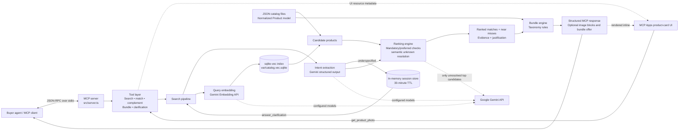

# MatchProof — Merchant-Side Commerce MCP Server

MatchProof is a TypeScript [Model Context Protocol (MCP)](https://modelcontextprotocol.io/) server for agentic product discovery. It turns a buyer's text request and optional reference image into structured intent, retrieves catalog candidates semantically, applies explicit product-attribute constraints, explains the ranking, and proposes compatible bundles.

The project is designed as a hackathon MVP: checkout and inventory are intentionally out of scope, while the retrieval, recommendation, clarification, and bundle flows are implemented end to end.

## Contents

- [Capabilities](#capabilities)
- [System architecture](#system-architecture)
- [Prerequisites](#prerequisites)
- [Quick start](#quick-start)
- [MCP tools](#mcp-tools)
- [Data and vector index](#data-and-vector-index)
- [Development and validation](#development-and-validation)
- [Project structure](#project-structure)
- [Operational notes](#operational-notes)
- [Known limitations](#known-limitations)

## Capabilities

- Natural-language product search across clothing, electronics, skincare, and home goods.
- Multimodal matching from a text query, a local image, a public image URL, or base64 image data.
- Structured intent extraction with targeted follow-up questions when a request is underspecified.
- Hybrid retrieval: Gemini embeddings + sqlite-vec similarity search, followed by deterministic constraint evaluation and a limited semantic resolution pass.
- Transparent results with product metadata, match evidence, near misses, and image content blocks where available.
- An inline MCP Apps product-card view for compatible clients, including product photography fetched on demand.
- Complementary-item discovery and taxonomy-driven bundle suggestions with mocked discounts.
- Session-based clarification continuation with a 30-minute in-memory TTL.

## System architecture



### Request lifecycle

1. An MCP client calls a search-oriented tool with buyer text and, optionally, one reference image.
2. Gemini extracts a category, item type, mandatory constraints, and preferences. Ambiguous requests become a saved clarification session.
3. The server embeds the request and searches the prebuilt sqlite-vec index. The catalog is filtered to the relevant category or complementary-item pool.
4. The ranking engine enforces mandatory criteria, prioritizes preferred criteria, uses vector similarity as a tie-breaker, and calls Gemini only for unresolved attributes among the best candidates.
5. The response returns eligible matches, close non-matches, evidence for each constraint, and an automatic bundle offer when applicable.
6. MCP Apps-capable hosts can render the returned results as inline product cards and request product images through the UI-only photo tool.

## Prerequisites

- Node.js 20 or later (Node.js 22 is recommended).
- npm.
- A Google Gemini API key with access to the configured text and embedding models.

The runtime uses `gemini-3.5-flash-lite` for structured reasoning and `gemini-embedding-2` for multimodal embeddings. Both identifiers are centralized in [`src/config/model.ts`](src/config/model.ts).

## Quick start

From the repository root:

```bash
npm install
cp .env.example .env
```

Add your key to `.env`:

```dotenv
GEMINI_API_KEY=your_api_key_here
```

The repository includes a populated vector index for the committed catalog. Start the MCP server with:

```bash
npx tsx src/server.ts
```

The server communicates over **stdio**, not HTTP. Keep standard output exclusively for MCP JSON-RPC; operational logs are written to `var/server.log`.

### MCP client configuration

Use the following command in an MCP-compatible client. Replace `/absolute/path/to/UAVS-Hackathon-2026` with your checkout path.

```json
{
  "mcpServers": {
    "matchproof": {
      "command": "npx",
      "args": [
        "tsx",
        "/absolute/path/to/UAVS-Hackathon-2026/src/server.ts"
      ]
    }
  }
}
```

For a quick local call without configuring a client:

```bash
npx tsx src/scripts/test-client.ts ping '{"message":"ready"}'
npx tsx src/scripts/test-client.ts get_bundle_suggestions '{"anchor_product_id":"DEMO-WATCH-EXACT"}'
```

## MCP tools

| Tool | Purpose | Required input |
|---|---|---|
| `search_exact_product` | Finds products from a natural-language request, optionally grounded by an image. | `query` |
| `find_matching_product` | Finds products similar to a reference image while respecting stated needs. | Image + `intent_text` |
| `find_complementary_product` | Finds items that pair with a catalog product or an image-resolved anchor. | `anchor_product_id` or image |
| `get_bundle_suggestions` | Returns up to two compatible products and a mocked bundle-price proposal. | `anchor_product_id` |
| `answer_clarification` | Resumes a previous search after the buyer answers a question. | `session_id`, `answer` |
| `ping` | Verifies that the MCP server is reachable. | None |

Search and matching tools accept exactly one of `image_path`, `image_url`, or `image_base64` when an image is supplied. Prefer a path or URL; base64 is intended for programmatic clients.

Successful search responses include `status`, `session_id`, `ranked_results`, and `secondary_results`. Product results carry source metadata, normalized fields, per-criterion evaluation evidence, similarity, and a deterministic justification. A `needs_clarification` result includes the session ID and a focused question for `answer_clarification`. Compatible MCP Apps hosts render the same result payload as inline product cards; other clients can use the structured response and image content blocks directly.

## Data and vector index

The demo catalog covers clothing, electronics, skincare, and home-goods product schemas. Raw records are normalized into the common `Product` model in [`src/types/catalog.ts`](src/types/catalog.ts). Category-specific fields remain available in `attributes`, while a flattened `embeddingText` provides retrieval context.

The repository includes a prebuilt sqlite-vec index at `var/catalog.vec.sqlite`. Rebuild it after changing catalog contents or the embedding model:

```bash
npx tsx src/scripts/build-embeddings.ts
```

The build is resumable: entries already present in the index are skipped, and stale entries are pruned. It makes live Gemini API calls and deliberately throttles them for free-tier limits, so a full rebuild can take time.

To regenerate the controlled non-clothing demo catalog before rebuilding vectors:

```bash
npm run build:demo-catalog
```

See [`data/README.md`](data/README.md) for source-data provenance, reproduction details, and H&M image licensing constraints.

## Development and validation

Run the project's automated local checks:

```bash
npm test
```

This runs demo-catalog and ranking assertions, followed by TypeScript type checking. It does not make live Gemini API calls.

Useful manual checks:

```bash
# Verify vector retrieval; requires GEMINI_API_KEY
npx tsx src/scripts/search-demo.ts "black running shoes" --category clothing --top-k 5

# Exercise deterministic ranking only
npx tsx src/scripts/rank-demo.ts

# Validate structured extraction parsing without a network request
npx tsx src/scripts/test-extraction-parsing.ts
```

## Project structure

```text
src/
  server.ts                 MCP stdio server and tool registration
  mcp/                      Tool contracts, orchestration, and MCP formatting
  mcp/ui/                   Inline MCP Apps product-results interface
  extraction/               Gemini-backed intent extraction and schema validation
  embedding/                Gemini embedding client and sqlite-vec access
  catalog/                  JSON loading, normalization, and repository access
  ranking/                  Deterministic and semantic constraint evaluation
  bundling/                 Category-taxonomy complement and bundle rules
  session/                  Ephemeral clarification-session storage
  config/                   Environment, model, paths, logging, and rate limiting
  scripts/                  Smoke tests, validation, retrieval, and indexing utilities
data/                       Catalog fixtures and clothing images
var/catalog.vec.sqlite      Prebuilt local vector index
```

## Operational notes

- The server resolves project paths from the source file location rather than the caller's working directory, so it can be launched from an MCP client safely.
- Gemini calls share a conservative in-process throttle to reduce free-tier `429` responses. Latency increases when several requests require generation or semantic evaluation.
- The server is stateful only in memory for clarification sessions. Restarting the process invalidates outstanding `session_id` values.
- Do not print diagnostics to standard output while the server is running; stdio is the transport. Inspect `var/server.log` instead.
- Never commit `.env` or an API key.

## Known limitations

- This is a demo catalog, not a live merchant feed; availability, inventory, and pricing are not synchronized with a commerce platform.
- Bundle discounts are mocked and `get_bundle_suggestions` is informational only. No payment, checkout, order creation, or stock reservation tool is implemented.
- Ranking quality depends on fixture coverage and Gemini API availability. Image matching is strongest where the catalog has representative product imagery.
- Sessions are process-local and expire after 30 minutes; production deployment would use durable, tenant-scoped storage.
- Review the source-data licence in [`data/README.md`](data/README.md) before reusing any bundled assets.
