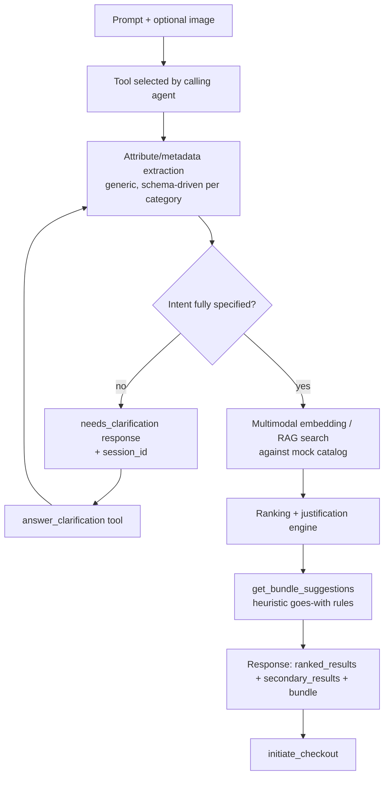

# Products.md — Merchant-Side Agentic Commerce MCP Server

**Challenge:** UAVS Hackathon 2026 — The B2A Shift (FPT Australasia)
**Perspective:** Merchant-side. We are not building the buyer's AI agent — we are building the
system a buyer's AI agent talks to.

## 1. Problem Statement

AI shopping agents (LLM copilots, autonomous assistants) are increasingly the ones searching,
comparing, and buying on a human's behalf. They don't respond to visual merchandising or SEO —
they need structured, queryable, machine-readable product data and an API surface they can reason
over. Most merchants today expose neither. Two failure modes result:

- **Invisibility**: the agent can't decode what the merchant actually sells against the buyer's
  real intent (multi-constraint, personal-preference-laden queries).
- **Poor conversion**: even when a match exists, the merchant has no way to prove *why* it's the
  right match, or to upsell/bundle the way a human sales associate would, or to close the
  transaction without a human-oriented checkout UI in the way.

## 2. Solution Overview

An MCP server, callable by any buyer-side AI agent, that acts as a merchant's agentic storefront.
It accepts natural-language prompts plus optional reference images, decodes intent against a
product catalog spanning multiple categories, returns ranked + justified recommendations
(including bundle upsells), asks clarifying questions when intent is underspecified, and closes
the loop with a mocked API-driven checkout.

The workflow is designed to be **category-agnostic**: no tool hardcodes "shirt" or "earbud" logic;
category-specific behavior comes from attribute schemas and catalog data, not code branches.

## 3. Users / Actors

| Actor | Role |
|---|---|
| Buyer's AI agent | Primary API consumer — calls our MCP tools |
| Human buyer (behind the agent) | Indirect — supplies intent/images via their agent |
| Merchant (us, conceptually) | Owns the catalog, bundling rules, and MCP server |

Out of scope: building the buyer-facing agent itself, and human-facing UI/UX polish (per official
brief — judged priority is machine-to-machine interaction quality, not dashboard visuals).

## 4. Scope (Hackathon MVP)

**In scope:**
- Synthetic/mock catalog we author ourselves — 4 categories: **clothing, electronics, home goods,
  skincare**.
- Multimodal (text + image) intent decoding and product matching.
- Session-based clarification loop for ambiguous/preference-driven queries.
- Ranking with justification, including visible secondary/rejected candidates.
- Mocked dynamic bundling with heuristic discounts.
- Mocked API-driven checkout (closes the loop per the official desired-outcome flow).

**Out of scope (explicitly deferred):**
- Real inventory, pricing, or payment processing — checkout is a simulated API call.
- Real AI-to-AI negotiation protocol (budget haggling) — noted as future work; not build this round.
- Consumer-facing UI — this is an API/MCP surface, not a storefront.
- Physical fulfillment/logistics.

## 5. User Stories → Capabilities

1. **Exact search** — complex query or reference image → find matching products.
   *"Skincare for acne-prone oily skin"; "ANC earbuds, good sound, black, under $200 AUD."*
2. **Tailored search** — take a reference image/product and adapt to stated needs.
   *"White cooling-material shirt for a wedding, styled like this reference photo."*
3. **Complementary search** — find products that pair with an existing product.
   *"Pants that go with this shirt."*
4. **Dynamic bundling** — merchant-side upsell: when a core product is requested, propose
   complementary items at a slight bundle discount to increase basket size.
5. **Ranked + justified results** — every response ranks candidates against the decoded criteria
   and explains *why*, and surfaces a few secondary/rejected items as evidence the search was
   thorough, not just a top-1 guess.
6. **Checkout** *(added from the official brief's "closing the loop" requirement — not in your
   original stories, flagging it as a deliberate addition)* — a mocked, API-driven transaction
   that finalizes a purchase from a confirmed product/bundle selection.

## 6. MCP Tool Surface

One tool per user story, since that gives the calling agent explicit, self-describing entry points
(judging criterion #2 rewards clean API/tool design over a single opaque "do everything" call).

| Tool | Purpose | Key inputs | Key outputs |
|---|---|---|---|
| `search_exact_product` | Story 1 | `query`, `images?`, `constraints?`, `session_id?` | ranked matches + justification + rejected examples, or `needs_clarification` |
| `find_matching_product` | Story 2 | `reference_image`, `intent_text`, `session_id?` | ranked matches tailored to reference + stated needs |
| `find_complementary_product` | Story 3 | `anchor_product_id` or `anchor_image`, `session_id?` | ranked complementary products + justification |
| `get_bundle_suggestions` | Story 4 | `anchor_product_id` | bundle proposal(s) with mocked discount |
| `answer_clarification` | Resolves any tool's `needs_clarification` response | `session_id`, `answer` | resumes original tool's pipeline with the new constraint applied |
| `initiate_checkout` | Story 6 | `session_id`, `selected_product_ids` | mocked order confirmation (status, order id, total) |

All search/match tools share the same response shape: `status` (`ok` / `needs_clarification`),
`ranked_results[]` (each with a `justification` string tied to the decoded criteria), and
`secondary_results[]` (near-misses, with the criterion they failed).

## 7. Architecture / AI Workflow

Shared internal components, reused across every tool (this is what keeps the workflow generic):

- **Attribute extraction**: LLM-driven, maps free text + image into a category's attribute schema
  (e.g. skincare: skin-type, concern, ingredient-exclusions; electronics: feature-flags, price-cap,
  color). Same extractor, different schema per category — no per-category code branching.
- **Multimodal embedding/RAG**: text + image embeddings for similarity search when the query is
  about "look/feel like this" rather than strict attribute filters.
- **Ranking + justification**: scores candidates against decoded mandatory vs. preferred criteria;
  every returned item carries a plain-language reason; near-miss items are retained and returned
  as `secondary_results` with the criterion they failed, rather than silently dropped.
- **Clarification detector**: flags under-specified or preference-heavy queries (e.g. "match my
  style") and emits a targeted follow-up question instead of guessing.
- **Session store**: keyed by `session_id`, holds original query + extracted attributes so far +
  clarification history. Server-side, short TTL (demo-scoped, in-memory is fine). The calling agent
  is responsible for passing the same `session_id` back on follow-up calls.
- **Bundling engine**: heuristic "goes-with" category map (e.g. facewash → toner, moisturiser) +
  flat mocked discount. Not a real pricing/margin system.
- **Checkout**: mocked endpoint that returns a fake order confirmation — satisfies the "close the
  loop via API-driven transaction" judging requirement without real payment integration.

## 8. Data Model (Mock Catalog)

- 4 categories: clothing, electronics, home goods, skincare.
- Each product: id, category, title, image(s), price (AUD), and a **category-specific attribute
  set** (defined per category, not shared) — e.g. clothing: material, fit, color, occasion;
  skincare: skin-type, concern, key-ingredients; electronics: feature-flags, connectivity, price
  tier; home goods: room, material, style-tag.
- Enough products per category (and enough near-misses) that ranking + secondary/rejected results
  are meaningful, not trivial.

## 9. Alignment to Judging Criteria

| Priority | How this design addresses it |
|---|---|
| 1. Intention accuracy & semantic matching | Generic attribute-extraction + embedding/RAG pipeline, clarification loop for underspecified intent |
| 2. Technical architecture | Clean per-story MCP tool surface, session-based multi-turn state, shared generic pipeline across categories |
| 3. Business value & conversion | Justified rankings (proof of fit), bundling upsell, checkout closes the loop |

## 10. Open Questions / Risks

- **Embedding model / vector store choice** — not yet decided (e.g. CLIP-style multimodal embedding
  + a lightweight vector index). Needs a decision before implementation starts.
- **Image input transport** — base64 inline vs. URL reference over MCP; needs to be pinned down in
  the tool schemas.
- **Session TTL and storage** — in-memory is fine for a demo but will not survive a server restart;
  acceptable for hackathon scope, called out here so it isn't mistaken for a production decision.
- **AI-to-AI negotiation** (budget haggling, mentioned as an illustrative direction in the official
  brief) is not in this MVP — flagged as a natural extension if time allows after the core loop works.
- **What "3-4 categories for breadth" costs us in depth** — with 4 categories, per-category attribute
  schemas and catalog size need to stay small enough to build in the available hackathon time; if
  time runs short, cut to 2-3 categories rather than thin out the per-category logic.
